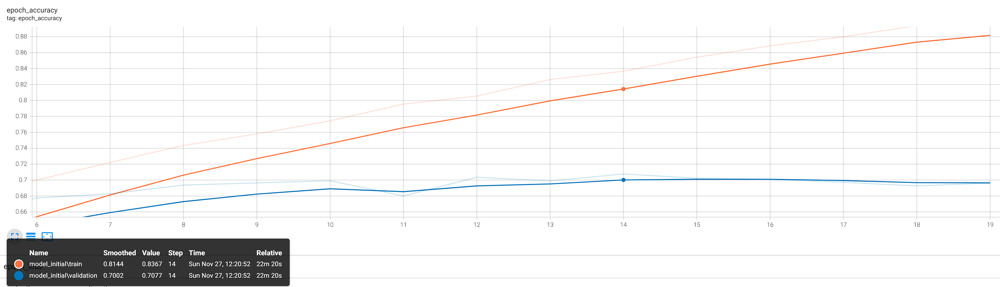

# Convolutional Neural Network trained on the CIFAR10-Dataset

This example shows how to train a convolutinal neural network on the cifar10 dataset. I tried to compare different models and experiments to get the best possible performance on accuracy with minimal effort.

## About the dataset

This dataset contains 50,000 32x32 color training images and 10,000 test images, labeled over 10 categories.

## Classes

|Label|Description|
|-----|-----------|
|0|airplane|
|1|automobile|
|2|bird|
|3|cat|
|4|deer|
|5|dog|
|6|frog|
|7|horse|
|8|ship|
|9|truck|

## Possible improvements of the network

- activation functions
- dropout rates
- batch normalization
- learning rates
- early stopping
- global pooling

The performance of the network is analysed through tensorboard.

## Performance

- Initial model performance

